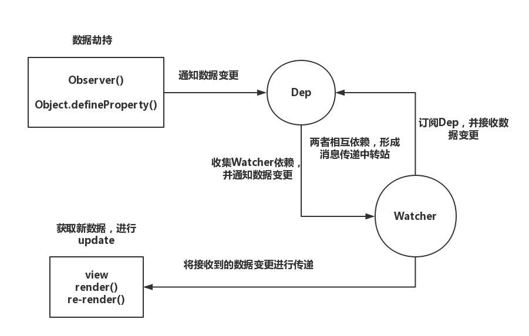

# Vue 观察者模式


<hr/>

## Object.defineProperty(obj, prop, descriptor)
- useage 
``` javascript
    // 正常定义对象值
    let obj = {};
    obj.test = 1;

    // 使用此api
    let obj = {};
    let temp = null;
    Object.defineProperty(obj, 'test', {
        get() {
            console.log('拦截成功，执行某种操作');
            return temp;
        },
        set(newVal) {
            /* do something */
            console.log('value is being setting');
            temp = newVal;
        }
    });

    obj.test = '11'; // => 拦截成功，执行某种操作
    obj.test; // => value is being setting
```

<hr/>

## 

## dep
> 功能：依赖管理
``` javascript
class Dep {
    constructor() {
        this.subs = [];
    }

    addSub(sub) {
        this.subs.push(sub);
    }

    removeSub(sub) {
        const index = this.sbus.indexOf(sub);
        if (index >= 0) {
            this.sbus.splice(index, 1);
        }
    }

    notify(newVal, oldVal) {
        // this.subs.forEach(func => func(newVal, oldVal);
        this.subs.forEach(watcher => watcher.update());
    }
}

Dep.target = null;
```

<hr/>

## defineReactive
> 功能：遍历对象每个属性，便捷实现依赖收集
``` javascript
let defineRective = function(obj, key, value) {
    let dep = new Dep();
    Object.defineProperty(obj, key, {
        configurable: true,
        enumerable: true,
        get: function() {
            if (Dep.target) {
                dep.addSub(Dep.target);
                Dep.target.addDep(dep);
            }
            return value;
        },
        set: function(newvVal) {
            if (newVal !== oldVal) {
                value = newVal;
                dep.notify();
            }
        }
    })
}
```
> 问题所在：
1.`Dep`这个没有完全解耦，因为在出发依赖的时候仍然需要传入新旧值
2.`removeSub`方法没有用到，这也就意味着依赖无法取消绑定，因为此方法是绑定在`Dep`实例上的，而在这里`Dep`处在闭包中，外部无法访问到；因此，vue中使用了`Watcher`类来解决这个问题

<hr/>

## Watcher
> 功能：
``` javascript
    class Watcher {
        constructor(obj, key, callback) {
            this.obj = obj;
            this.getter = key;
            this.cb = callback;
            this.deps = [];
            // this.value = undefined;
            this.value = this.get();
        }

        // 将当前watcher实例赋值给Dep.target，完成依赖收集
        get() {
            Dep.target = this;
            let value = this.obj[this.getter];
            Dep.target = null
            return value;
        }
            
        addDep(dep) {
            const index = this.deps.indexOf(dep);
            if (index >= 0) {
                this.dep.push(dep);
            }
        }

        // 依赖变化时，执行回调
        update() {
            const value = this.obj[this.getter];
            const oldValue = this.value;
            this.value = value;
            this.cb.call(this.obj, value, oldVal);
        }
    }
```
> 要素：监听对象、取值方法、对应的回调、需要监听的值、取值函数、触发函数